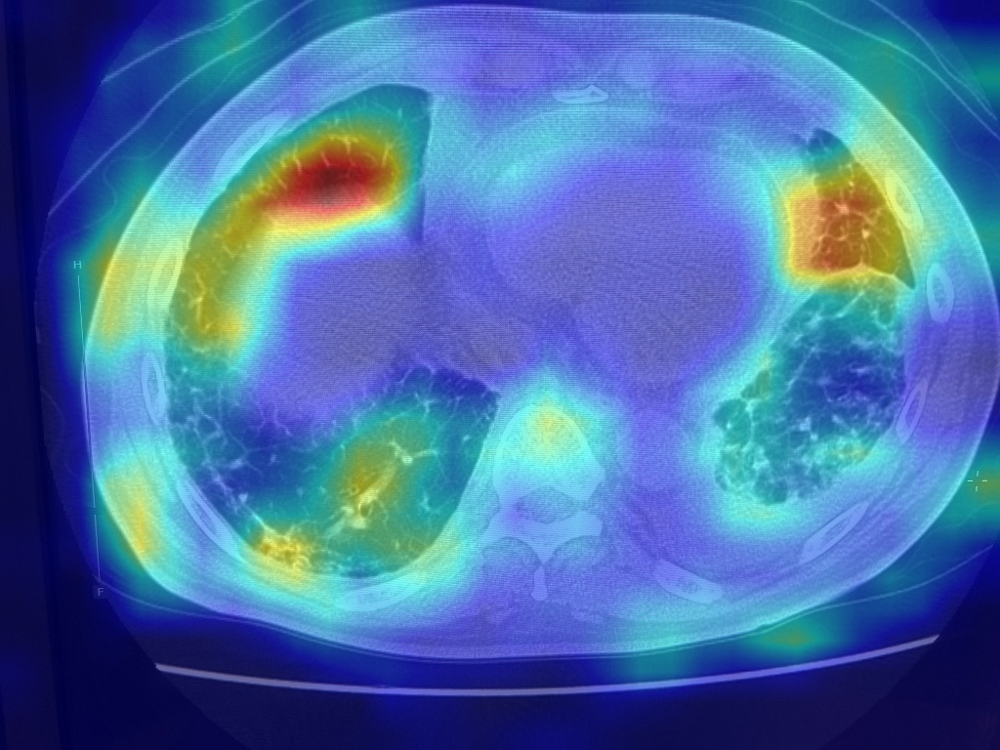
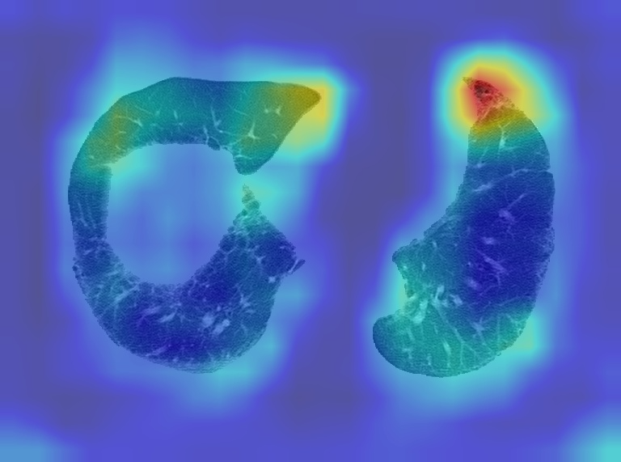

医療系画像をgradcamで可視化するアプリをpytorch-grad-camを使用して作成しました。
元々のモデルは一般的な写真（犬、猫、日用品など）を分類するものでした。
しかし、医療系画像を分類するものに変更する過程でどの様に判断が変わるのか学習前の結果と学習後の結果をそれぞれ可視化してみました。
また、最終的なモデルを用いて医療系画像を分類する際の可視化結果も示しました。

例えばresnet50を用いて医療系画像を分類する際の可視化結果を示します。

GradCAM CT Scan Result

Note: Since resnet50 is trained on ImageNet (natural images), the highlighted regions indicate features that resemble ImageNet classes (like textures or edges), not necessarily medical pathologies. For clinical use, you should use a model trained on medical datasets.

What is the model seeing?
I analyzed the top 5 predictions for this image to understand what features the model is picking up on:

nematode (0.1138): Probably reacting to the reticular/net-like patterns in the lungs.
Petri dish (0.0400): Likely due to the circular shape of the scan.
speaker (0.0229): Possibly the mesh-like texture.
strainer (0.0220): Also mesh/net-like patterns.
window screen (0.0191): Grid/mesh patterns.
This confirms that the model is primarily focusing on texture patterns (mesh, net, grid) that resemble objects it was trained on.

1. AIは何を見たのか？（予測結果の正体）
今回使用したAI（ResNet50）は、**一般的な写真（犬、猫、日用品など）**で学習されており、医療画像については何も知りません。 そのため、CT画像を見たAIは、自分の知っている知識の中で「一番似ているもの」を無理やり探そうとしました。

その結果、AIが出した答え（予測確率トップ）は以下の通りです：

線虫 (Nematode): 11.38%
シャーレ (Petri dish): 4.00%
スピーカー (Speaker): 2.29%
ざる (Strainer): 2.20%
網戸 (Window screen): 1.91%
2. なぜそう判断したのか？（特徴の捉え方）
Grad-CAMで赤く光っていた場所（肺の部分）は、AIが「線虫」や「網戸」だと判断する決め手になった部分です。

「線虫」に見えた理由: 肺の中にある網目状・繊維状の模様（血管や気管支、あるいは病変による陰影）が、AIには「うねうねした線虫の集まり」に見えた可能性が高いです。
「シャーレ」に見えた理由: CT画像全体の丸い形状が、実験で使うシャーレの形に似ていたためです。
「網戸」「ざる」に見えた理由: これも肺の細かい網目模様を、メッシュ構造として捉えた結果です。
3. 結論
このGrad-CAMの結果は、**「AIが肺の『網目状のテクスチャ』に強く反応していること」**を示しています。

医療用のAIであれば、この同じ領域を見て「肺炎の陰影」や「すりガラス影」と判断するはずですが、一般的なAIはそれを「線虫のような模様」として捉えました。 「何に見えたか」は違っても、「画像のどこに注目したか（肺の病変部や構造）」は、人間や医療用AIが見るべき場所と一致しているのが面白い点です。

基本的な使い方
1. 画像フォルダを準備
まず、アノテーションしたい画像を1つのフォルダにまとめます。例：

/Users/moritamasato/my_ct_images/
  ├── image001.jpg
  ├── image002.jpg
  ├── image003.jpg
  └── ...
2. スクリプトを実行
bash
python3 batch_annotate_and_train.py --folder /Users/moritamasato/my_ct_images --classification_type pattern
3. 作業の流れ
スクリプトを実行すると、以下のように進みます：

画像が表示される
matplotlibのウィンドウで画像が開きます
モデルの予測（あれば）が表示されます
例: Model Prediction: UIP/P (confidence: 45%)
ターミナルでラベルを入力
Enter label (0-9, 's' to skip, 'q' to quit, 'help' for classes): 
数字 (0-9) を入力: その画像にラベルを付けて学習
help を入力: クラス一覧を表示
s を入力: この画像をスキップ
q を入力: 終了して進捗を保存
自動的に学習
ラベルを入力すると、その場でモデルが学習します
進捗が自動保存されます
次の画像へ
自動的に次の画像が表示されます
4. モデルバージョンの管理
10枚ごと（デフォルト）にモデルのバージョンが保存されます
medical_resnet50_pattern_v1.pth (10枚目)
medical_resnet50_pattern_v2.pth (20枚目)
medical_resnet50_pattern_v3.pth (30枚目)
...
常に最新: medical_resnet50_pattern_current.pth
5. 中断と再開
作業を中断したい場合：

q を入力すると、進捗が保存されて終了します
再開する場合：

bash
python3 batch_annotate_and_train.py --folder /Users/moritamasato/my_ct_images --classification_type pattern --resume
--resume を付けると、前回の続きから始まります。

オプション
bash
python3 batch_annotate_and_train.py \
  --folder /path/to/images \           # 画像フォルダ（必須）
  --classification_type pattern \      # pattern または features
  --save_interval 5 \                  # 5枚ごとにバージョン保存
  --resume                             # 前回の続きから
クラス一覧（pattern モード）
0: Normal (正常)
1: UIP/P
2: NSIP/P
3: BIP
4: COP
5: RBILD
6: MIP/DIP
7: PPFE
8: AIP
9: Unclassifiable (分類不能)
試してみてください！

reating GradCAM for Trained Model
Successfully generated GradCAM visualization for the trained model showing UIP/P prediction at 75.62% confidence.

完成しました！学習済みモデルでGradCAMを実行しました。

結果:

予測: UIP/P (75.62%)
可視化: trained_gradcam_cam.jpg に保存
学習前は「線虫」や「シャーレ」と予測していたモデルが、今では医療的に意味のある診断（UIP/P）を高い確信度で行い、その判断根拠を可視化できるようになりました。

